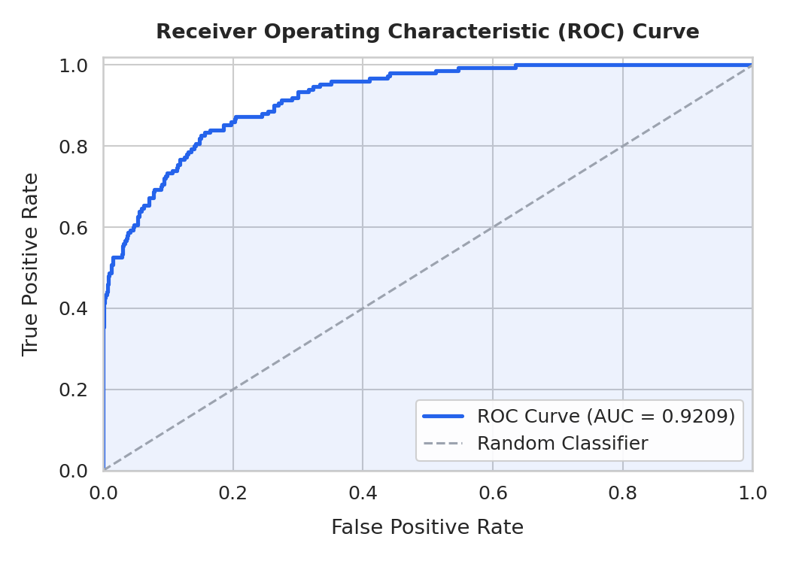
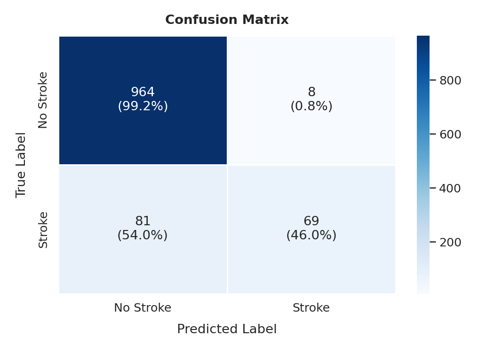

# Stroke Risk Prediction

[](LICENSE)
[](https://www.python.org/)
[](tests/)

Binary classification on an imbalanced medical dataset — **13.4% positive rate**, 5,610 patient records, 11 clinical features. The pipeline covers the full lifecycle: exploratory analysis, preprocessing, model training, evaluation, fairness analysis, and batch inference.

---

## Results

Stratified 80/20 split, evaluated on the held-out test set (1,122 patients).

| Metric | Score |
| --- | --- |
| **ROC-AUC** | **0.9209** |
| **Average Precision** | 0.7482 |
| **F1 — Stroke class** | 0.6079 |
| **Accuracy** | 0.9207 |

| ROC Curve | Confusion Matrix |
| --- | --- |
|  |  |

---

## Technical Decisions

Deliberate choices that shaped the outcome — not defaults.

| Decision | Why |
| --- | --- |
| **ROC-AUC as evaluation metric** | Accuracy is misleading at 13.4% positive rate — a model that always predicts "no stroke" scores 86.6% accuracy while being useless. ROC-AUC measures ranking quality across all thresholds, making it the correct signal for an imbalanced medical classifier. |
| **Stratified train/test split** | At 13.4% positive rate, a random split risks underrepresenting stroke cases in the test set. Stratification guarantees the positive rate is preserved in both partitions, making evaluation reliable. |
| **BMI imputed with median** | BMI is right-skewed. Mean imputation pulls estimates upward; median is robust to skew and avoids introducing systematic bias into a clinically important feature. |
| **`gender = 'Other'` recoded to mode** | Only one patient has this value. Keeping it creates a feature column with a single positive example, adding noise to model splits with no statistical benefit. |
| **Stacked ensemble model** | No single algorithm is universally best on tabular data. Combining gradient boosting, random forests, and neural networks via multi-layer stacking consistently outperforms individual models by reducing variance through model diversity. |
| **Per-learner categorical encoding** | Forcing one-hot encoding on all models is suboptimal — tree-based models perform better with label encoding, while neural networks benefit from learned embeddings. Each model receives the encoding suited to its architecture. |

---

## Pipeline

```text
Raw CSV
  │
  ▼
data_loader.py  ──▶  load + validate  (BMI 'N/A' strings → NaN)
  │
  ▼
preprocess.py   ──▶  drop id · recode 'Other' gender · median-impute BMI
                      stratified 80 / 20 split
  │
  ▼
train.py        ──▶  stacked ensemble  (gradient boosting · random forest · neural net)
                      eval_metric = roc_auc · multi-layer stacking · GPU-accelerated
  │
  ▼
evaluate.py     ──▶  ROC-AUC · confusion matrix · classification report
                      saves PNG plots + metrics.json to results/
```

---

## Structure

```text
stroke-prediction/
├── src/
│   ├── data_loader.py       # load + validate raw CSV
│   ├── preprocess.py        # clean, impute, split
│   ├── train.py             # model training + leaderboard
│   ├── evaluate.py          # metrics, plots
│   ├── main.py              # single entry point (train + evaluate)
│   └── predict.py           # batch inference on new patient data
├── notebooks/
│   ├── EDA.ipynb            # class imbalance, distributions, correlations
│   └── Predictions.ipynb    # results, feature importance, risk analysis,
│                            #   fairness analysis, business cost analysis
├── tests/
│   ├── test_data_loader.py  # unit tests for data_loader.py
│   └── test_preprocess.py   # unit tests for preprocess.py
├── models/                  # trained model artefacts (gitignored)
├── results/                 # leaderboard, feature importance, plots, metrics.json
├── Dockerfile               # reproducible container for training & inference
├── MODEL_CARD.md            # intended use, limitations, fairness, ethical notes
├── requirements.txt
└── .gitignore
```

---

## Usage

### Install

```bash
git clone <your-repo-url>
cd stroke-prediction
pip install -r requirements.txt
```

### Train

```bash
python src/main.py
```

### Predict on new patients

```bash
python src/predict.py --input new_patients.csv --output results/predictions.csv

# Lower threshold for high-recall clinical screening (catches more strokes)
python src/predict.py --input new_patients.csv --threshold 0.3
```

### Docker

```bash
docker build -t stroke-prediction .

# Inference
docker run \
  -v $(pwd)/models:/app/models \
  -v $(pwd)/new_patients.csv:/app/new_patients.csv \
  -v $(pwd)/results:/app/results \
  stroke-prediction python src/predict.py --input new_patients.csv
```

### Tests

```bash
pytest tests/ -v
```

---

## License

MIT © 2026
